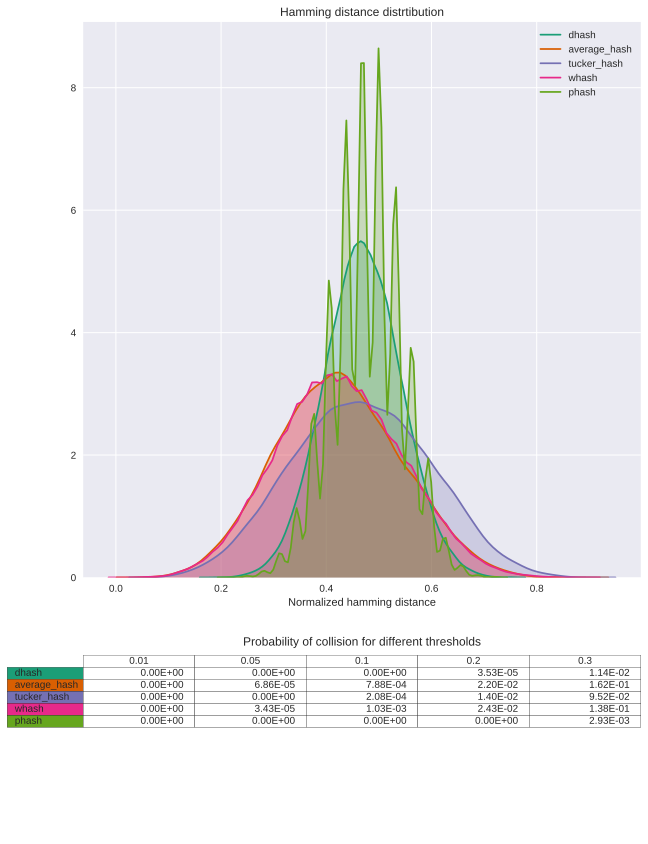
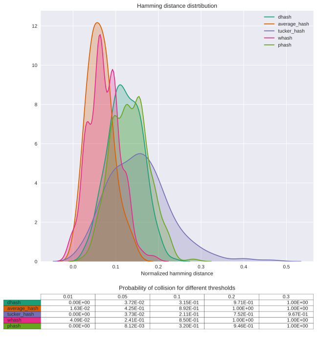
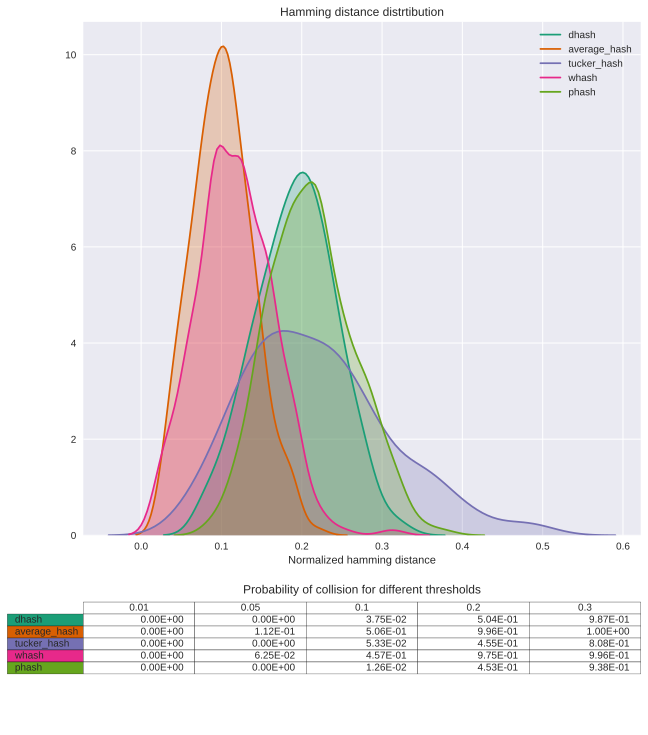
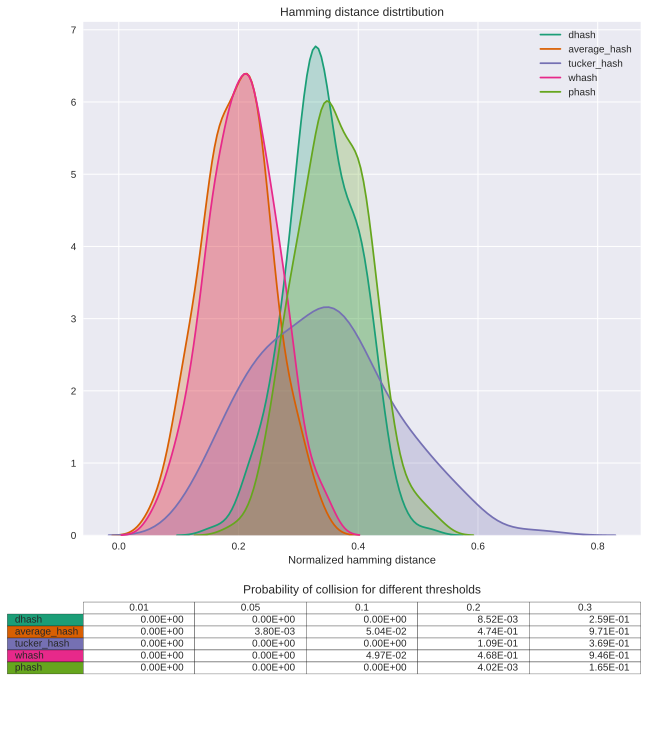
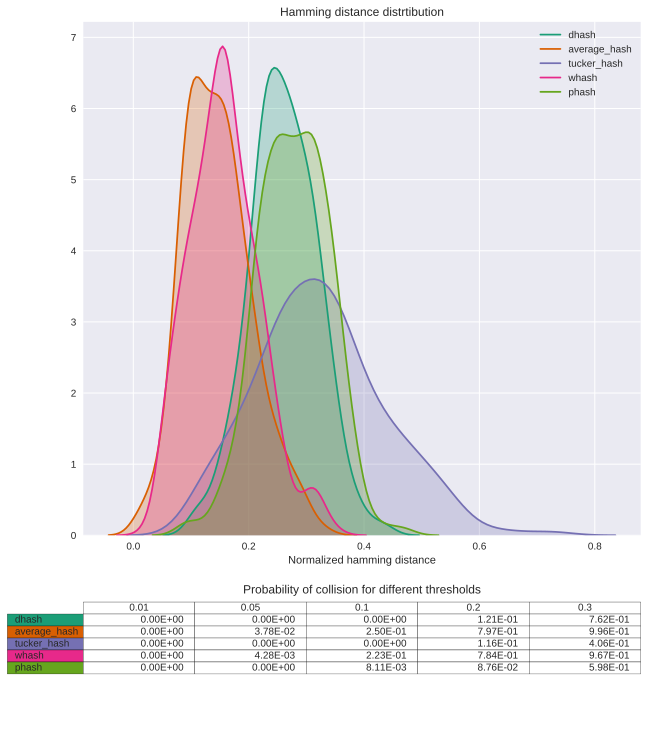
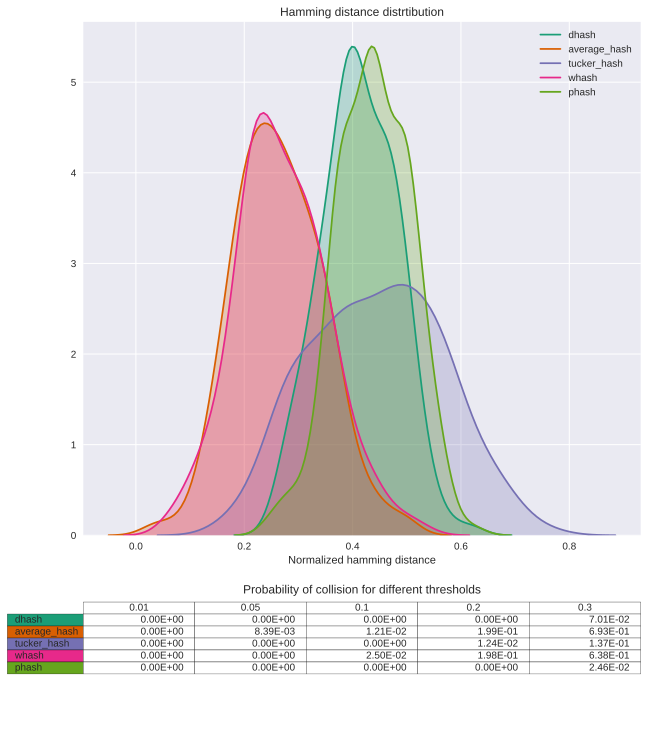
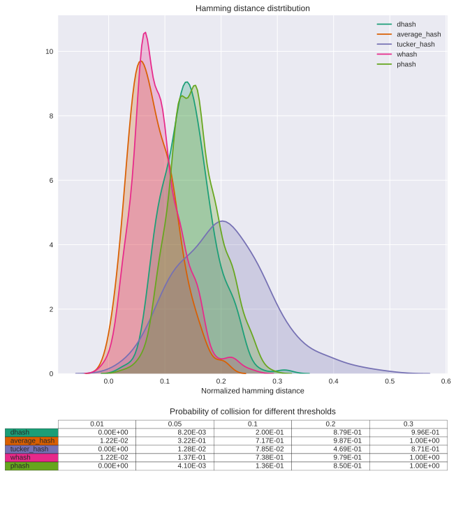

```python
from imagehash import dhash, average_hash, whash, phash
from thash.tucker_hash import tucker_hash
from utils import hash_collision_test, image_rotate_test, image_crop_test, make_dataset
import matplotlib.pyplot as plt
```


```python
hashes = {
    'dhash': dhash,
    'average_hash': average_hash,
    'tucker_hash': tucker_hash,
    'whash': whash,
    'phash': phash
}
```


```python
dataset = make_dataset()
```


```python
hash_collision_test(hashes, dataset)
```





```python
image_rotate_test(hashes, dataset, 1)
```


```python
image_rotate_test(hashes, dataset, 3)
```





```python
image_rotate_test(hashes, dataset, 5)
```





```python
image_rotate_test(hashes, dataset, 10)
```





```python
image_crop_test(hashes, dataset, 10)
```





```python
image_crop_test(hashes, dataset, 20)
```





```python
image_crop_test(hashes, dataset, 5)
```




